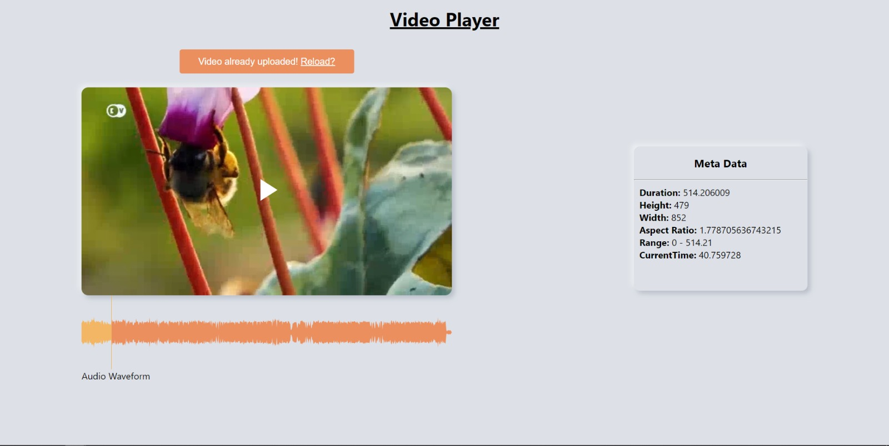

 

  <h3 align="center">Vidyo.ai SELECT 2024 Internship Round 2 Assignment</h3>

  

    <a href="https://vidyo-assignment.vercel.app/">View Demo</a>
  

## About The Project

This project was assigned to me by <a href="https://vidyo.ai/">Vidyo.ai</a> as a Round 2 Assessment project for SELECT 2024 internship. I am grateful to <a href="https://vidyo.ai/">Vidyo.ai</a> for considering me for this role. I am also thankful to <a href="https://github.com/s-r-aman">SR Aman</a> for supporting me in application process.

This project is designed to help you interact with various HTML5 elements, including Canvas, Video, and Audio. The project is divided into two parts, each with specific tasks.

<b>Part 1: Video File Handling</b>

1. <b>Input Video File</b>: Users can upload a video file of their choice.
2. <b>Display Video Metadata</b>: The uploaded video's metadata, including its duration, will be displayed on the user interface.
3. <b>Display Video with Play/Pause Controls</b>: The selected video will be displayed on the screen using the HTML 'Canvas' element. A play/pause button will be placed in the middle of the video container, allowing users to control video playback by clicking on it.

<b>Part 2: Audio Detection and Waveform Display</b>

1. <b>Detect Audio Presence</b>: The project will determine if the uploaded video contains audio. If no audio is present, the user will be prevented from uploading the file.
2. <b>Display Audio Waveform</b>: If audio is detected, the project will display the audio waveform in a box below the video, as illustrated in the provided diagram.

## Getting Started

To use this React.js project, follow these steps:

1. Clone or download the project repository to your local machine.

2. Open the project folder in your preferred code editor.

3. Install project dependencies using the following command:
   `npm install`

4. Start the development server with:
   `npm start`

5. Open your web browser and navigate to http://localhost:3000 to use the application.
